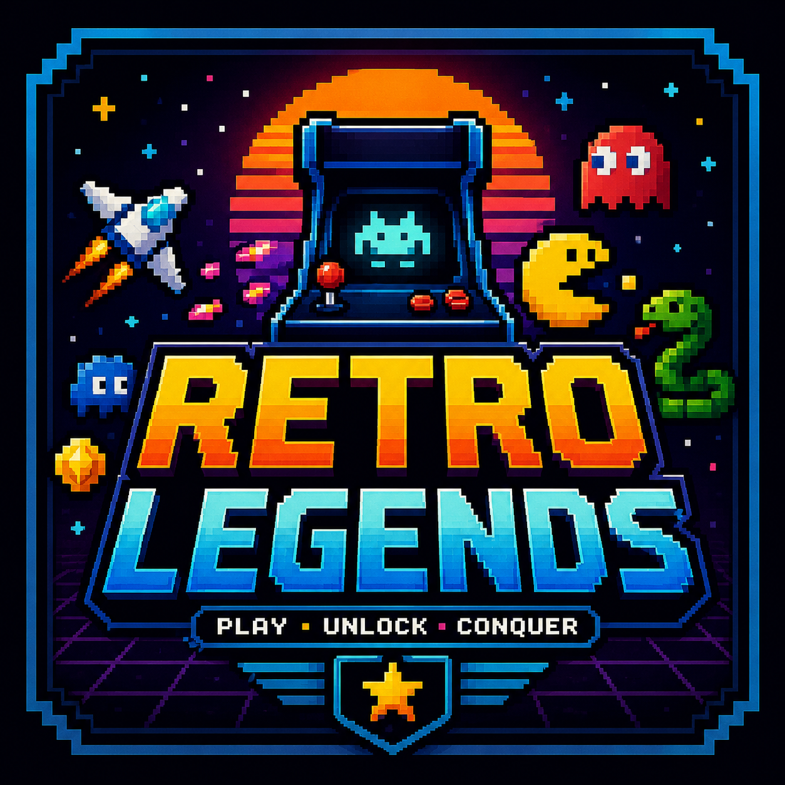

# 🏛️ ARQUITECTURA TÉCNICA - Retro Legends

Documentación detallada de la arquitectura del sistema.

**GitHub**: [github.com/Rudepro/retro-legends](https://github.com/Rudepro/retro-legends)

---

## 📊 Diagrama de Flujo General

```
┌─────────────────────────────────────────────────────────────────┐
│                        LANDING PAGE                             │
│                      (index.html)                              │
└─────────────────────────────────────────────────────────────────┘
                              │
                ┌─────────────┼─────────────┐
                ▼             ▼             ▼
         ┌──────────┐  ┌──────────┐  ┌──────────┐
         │ Perfil   │  │Settings  │  │Logros    │
         │Modal     │  │Modal     │  │Dashboard │
         └──────────┘  └──────────┘  └──────────┘
                │
                └─────────────┬──────────────────┐
                              ▼                  ▼
                      ┌─────────────────┐  ┌──────────┐
                      │ GameManager     │  │Juego     │
                      │ .loadGames()    │  │Seleccionado
                      └─────────────────┘  │(8 opciones)
                              │            └──────────┘
                              ▼
                ┌─────────────────────────────────┐
                │  pages/[juego-id].html          │
                │  (Canvas + UI + Modales)        │
                └─────────────────────────────────┘
                              │
                ┌─────────────┼─────────────┐
                ▼             ▼             ▼
        ┌───────────┐  ┌───────────┐  ┌───────────┐
        │ Storage   │  │ Audio     │  │ Particles │
        │ (.save)   │  │ (.play)   │  │ (.burst)  │
        └───────────┘  └───────────┘  └───────────┘
                              │
                              ▼
                        ┌───────────┐
                        │ Browser   │
                        │ LocalStore│
                        └───────────┘
```

---

## 🎯 Patrones de Arquitectura

### 1. IIFE (Immediately Invoked Function Expression)

Cada módulo del sistema central usa el patrón IIFE para crear un namespace privado:

```javascript
const ModuleName = (() => {
  // Private variables
  let privateVar = 0;
  const privateFunc = () => { };
  
  // Public API
  return {
    publicMethod: () => { },
    publicProperty: 42
  };
})();
```

**Ventajas:**
- Encapsulación de estado privado
- Evita contaminación del scope global
- Permite namespaces claros

### 2. Class Pattern (Juegos)

Cada juego es una clase ES6 independiente:

```javascript
class MiJuego {
  constructor(canvas) {
    this.canvas = canvas;
    this.state = 'menu';
  }
  
  update(dt) { }
  draw() { }
  recordSession() { }
}
```

**Ventajas:**
- Encapsulación de estado por juego
- Ciclo de vida claro
- Fácil de testear

### 3. Observer Pattern (Logros)

GameManager observa estadísticas y dispara logros:

```javascript
recordGameSession(gameId, stats) {
  // Registrar stats
  this.checkAchievements(gameId, stats);
  
  // Si cumple condición → desbloquea logro
}
```

### 4. Singleton Pattern (Gestores)

Cada gestor (Storage, Audio, etc.) es un singleton global:

```javascript
window.AudioManager = (function() { ... })();
```

---

## 🔌 Módulos del Sistema Central

### Storage.js

**Responsabilidad**: Persistencia de datos en LocalStorage

**Estructura**:
```javascript
Storage.profile          // { name, avatar, id }
Storage.settings         // { music, sfx, crt, fps, language, theme }
Storage.statistics       // { totalTime, victories, defeats, coins }
Storage.gameStats        // { [gameId]: { plays, wins, bestScore } }
Storage.achievements     // { [id]: { unlocked, unlockedDate } }
Storage.progress         // { [gameId]: { level, checkpoint } }
Storage.unlocks          // { games: [], characters: [] }
```

**Métodos Principales**:
- `getProfile()` / `setProfile()`
- `getSettings()` / `updateSettings()`
- `getStatistics()` / `addGameStats()`
- `getAchievements()` / `unlockAchievement()`
- `getProgress()` / `setGameProgress()`
- `getUnlocks()` / `unlockGame()`
- `resetAllData()` (desarrollo)

**Ciclo de Vida**:
1. Script carga en orden: storage.js primero
2. DOMContentLoaded dispara inicialización
3. Crea keys de localStorage si no existen
4. Todos los demás módulos dependen de éste

---

### AudioManager.js

**Responsabilidad**: Síntesis de sonido retro con Web Audio API

**Estructura**:
```javascript
AudioContext
├─ masterGain [0, 1]
├─ musicGain [0, 1]
└─ sfxGain [0, 1]
```

**Métodos Principales**:
- `init()` - Crea AudioContext (lazy init on click)
- `playTone(freq, duration, type, volume)` - Base synth
- `playBeep()`, `playClick()`, `playSuccess()`
- `setMasterVolume()`, `setMusicVolume()`, `setSFXVolume()`
- `playRetroSynthLoop()` - Música ambient

**Frecuencias Comunes**:
- La: 440 Hz
- Do: 262 Hz
- Re: 294 Hz
- Mi: 330 Hz
- Fa: 349 Hz
- Sol: 392 Hz

**Tipos de Onda**:
- `sine` - Sonido suave
- `square` - Sonido arcade clásico
- `triangle` - Sonido medio
- `sawtooth` - Sonido metálico

---

### ParticleSystem.js

**Responsabilidad**: Efectos visuales con partículas 2D

**Estructura**:
```javascript
Particle {
  x, y           // Posición
  vx, vy         // Velocidad
  lifetime       // Duración
  color          // Color RGBA
  size           // Radio
}
```

**Métodos Principales**:
- `createEmitter(x, y, count, colors, speed)` - Burst radial
- `burstEffect(x, y, colors)` - Explosion de 12 partículas
- `trailEffect(x, y, vx, vy, color)` - 3 partículas siguiendo movimiento
- `update(dt)` - Física: gravedad, velocidad, fade
- `draw(ctx)` - Render con alpha
- `clear()` - Limpiar todo

**Física**:
- Gravedad: 300 px/s²
- Fricción: 0.98 por frame
- Alpha fade: lineal hasta 0

---

### VisualEffects.js

**Responsabilidad**: Efectos visuales CSS y Canvas

**Métodos Principales**:
- `applyCRTEffect(canvas, intensity)` - Scanlines en canvas
- `pixelate(canvas, pixelSize)` - Downsampling de píxeles
- Transiciones:
  - `fadeTransition()` - Opacity
  - `slideInTransition()` - Transform translate
  - `pulseEffect()` - Scale animation
  - `floatingEffect()` - Vertical float loop

**Keyframes Inyectados**:
- `@keyframes pulse`
- `@keyframes glitch`
- `@keyframes float`
- `@keyframes neon-glow`

---

### GameManager.js

**Responsabilidad**: Orquestación central de juegos y logros

**Estructura**:
```javascript
GameManager.games = [
  {
    id, name, title, description,
    genre, difficulty, path,
    playable, unlocks: { achievements, characters }
  }
]
```

**Métodos Principales**:
- `loadGames()` - Async fetch de games.json
- `getGame(id)`, `getAllGames()`, `getUnlockedGames()`
- `recordGameSession(gameId, stats)`
- `checkAchievements(gameId, stats)` - Valida condiciones
- `unlockGameContent(completedGameId)` - Chain unlocks
- `playGame(gameId)` - Navega a página de juego

**Logros Predefinidos**:
1. **first-game** - Jugar cualquier juego
2. **thousand-points** - Acumular 1000 puntos
3. **ten-victories** - Ganar 10 juegos
4. **[gameId]** - Completar juego específico
5. **coleccionista** - Desbloquear todos 8 juegos
6. **veterano** - Jugar 10 horas (36000 seg)

---

## 🎮 Estructura de Juegos

### Ciclo de Vida Estándar

```
┌──────────────┐
│   Página     │
│   Cargada    │
└──────┬───────┘
       │
       ▼
┌──────────────┐
│ initGame()   │ ← window.addEventListener('load')
└──────┬───────┘
       │
       ▼
┌──────────────────────┐
│ Constructor Juego    │ ← new MiJuego(canvas)
│ - Canvas setup       │
│ - Event listeners    │
│ - Game loop start    │
└──────┬───────────────┘
       │
       ▼
┌──────────────────────┐
│ Game Loop            │
│ requestAnimationFrame│◄──┐
│ - update(dt)         │   │
│ - draw()             │   │
└──────┬───────────────┘   │
       │                   │
       ├──────────────────┘
       │
       ├─ Pausa
       ├─ Game Over
       └─ Victoria
           │
           ▼
       ┌──────────────────┐
       │ recordSession()  │
       │ GameManager      │
       └──────┬───────────┘
             │
             ▼
         ┌────────────┐
         │ Storage    │
         │ (guardar) │
         └────────────┘
```

### Estructura HTML Estándar

```html
<!DOCTYPE html>
<html>
<head>
  <link rel="stylesheet" href="../assets/css/main.css">
  <style>/* Estilos específicos */</style>
</head>
<body>
  <!-- Canvas principal -->
  <canvas id="gameCanvas" width="800" height="600"></canvas>
  
  <!-- UI de juego (puntos, vidas, etc) -->
  <div class="game-ui">
    <div id="score">0</div>
  </div>
  
  <!-- Controles flotantes -->
  <div class="game-controls">
    <button id="pauseBtn">Pausa</button>
    <button id="menuBtn">Menú</button>
  </div>
  
  <!-- Modales (menú, pausa, game over) -->
  <div class="modal-overlay active" id="mainMenu">...</div>
  <div class="modal-overlay" id="pauseMenu">...</div>
  <div class="modal-overlay" id="gameOverMenu">...</div>
  
  <!-- Scripts (orden importante) -->
  <script src="../assets/js/storage.js"></script>
  <script src="../assets/js/audio.js"></script>
  <script src="../assets/js/particles.js"></script>
  <script src="../assets/js/effects.js"></script>
  <script src="../assets/js/game-manager.js"></script>
  <script src="js/mi-juego.js"></script>
</body>
</html>
```

### Estructura JavaScript Estándar

```javascript
class MiJuego {
  constructor(canvas) {
    this.canvas = canvas;
    this.ctx = canvas.getContext('2d');
    
    // State
    this.gameState = 'menu'; // menu, playing, paused, gameOver
    this.score = 0;
    this.gameTime = 0;
    
    // Game objects
    this.player = { x: 0, y: 0, vx: 0, vy: 0 };
    this.enemies = [];
    this.projectiles = [];
    
    // Input
    this.keys = {};
    
    this.init();
  }
  
  init() {
    this.setupInput();
    this.startGameLoop();
  }
  
  setupInput() {
    window.addEventListener('keydown', (e) => {
      this.keys[e.key] = true;
      if (e.key === ' ') this.action();
      if (e.key === 'p') this.togglePause();
      if (e.key === 'Escape') this.goHome();
    });
    window.addEventListener('keyup', (e) => { this.keys[e.key] = false; });
    this.canvas.addEventListener('click', () => this.action());
  }
  
  update(dt) {
    if (this.gameState !== 'playing') return;
    
    this.gameTime += dt;
    
    // Update player
    if (this.keys['ArrowLeft']) this.player.x -= 5;
    if (this.keys['ArrowRight']) this.player.x += 5;
    
    // Update enemies
    this.enemies.forEach(e => {
      e.x += e.vx * dt;
      e.y += e.vy * dt;
    });
    
    // Collision detection
    this.enemies = this.enemies.filter(e => {
      if (this.collide(this.player, e)) {
        this.gameOver();
        return false;
      }
      return true;
    });
    
    // Update particles
    ParticleSystem.update(dt);
  }
  
  draw() {
    // Clear canvas
    this.ctx.fillStyle = 'rgba(10, 14, 39, 0.8)';
    this.ctx.fillRect(0, 0, this.canvas.width, this.canvas.height);
    
    // Draw player
    this.ctx.fillStyle = '#00ff00';
    this.ctx.fillRect(this.player.x, this.player.y, 20, 20);
    
    // Draw enemies
    this.ctx.fillStyle = '#ff0000';
    this.enemies.forEach(e => {
      this.ctx.fillRect(e.x, e.y, e.width, e.height);
    });
    
    // Draw particles
    ParticleSystem.draw(this.ctx);
  }
  
  collide(a, b) {
    return a.x < b.x + b.width &&
           a.x + a.width > b.x &&
           a.y < b.y + b.height &&
           a.y + a.height > b.y;
  }
  
  action() {
    if (this.gameState === 'playing') {
      AudioManager.playBeep();
      this.score += 10;
    }
  }
  
  togglePause() {
    if (this.gameState === 'playing') {
      this.gameState = 'paused';
      document.getElementById('pauseMenu').classList.add('active');
    }
  }
  
  gameOver() {
    this.gameState = 'gameOver';
    AudioManager.playGameOver();
    GameManager.recordGameSession('mi-juego', {
      victory: false,
      score: this.score,
      playTime: this.gameTime
    });
    document.getElementById('gameOverMenu').classList.add('active');
  }
  
  startGameLoop() {
    let lastTime = Date.now();
    const gameLoop = () => {
      const now = Date.now();
      const dt = (now - lastTime) / 1000;
      lastTime = now;
      
      this.update(dt);
      this.draw();
      
      // Actualizar UI
      document.getElementById('score').textContent = this.score;
      
      requestAnimationFrame(gameLoop);
    };
    requestAnimationFrame(gameLoop);
  }
}

// Global initialization
let game = null;

function initGame() {
  game = new MiJuego(document.getElementById('gameCanvas'));
}

function startGame() {
  game.gameState = 'playing';
  document.getElementById('mainMenu').classList.remove('active');
}

function resumeGame() {
  game.gameState = 'playing';
  document.getElementById('pauseMenu').classList.remove('active');
}

function goHome() {
  window.location.href = '../index.html';
}

// Event listeners
document.getElementById('pauseBtn').addEventListener('click', () => {
  if (game.gameState === 'playing') {
    game.gameState = 'paused';
    document.getElementById('pauseMenu').classList.add('active');
  }
});

document.getElementById('menuBtn').addEventListener('click', goHome);

window.addEventListener('load', initGame);
```

---

## 📡 Flujo de Datos

### Inicialización

```
1. index.html carga
2. Scripts se cargan en orden:
   a. storage.js      (inicializa localStorage)
   b. audio.js        (prepara Web Audio)
   c. particles.js    (sistema de partículas)
   d. effects.js      (inyecta CSS keyframes)
   e. game-manager.js (carga games.json)
   f. landing.js      (renderiza landing page)
```

### Jugar un Juego

```
1. User clic en juego en landing
2. landing.js: playGame(gameId)
3. AudioManager.playSuccess()
4. window.location = game.path
5. Página de juego carga
6. initGame() instancia clase
7. Game loop comienza
```

### Guardar Progreso

```
1. Juego termina (victoria/derrota)
2. Game.recordSession()
3. GameManager.recordGameSession()
4. Storage.addGameStats()
5. GameManager.checkAchievements()
6. Si cumple → Storage.unlockAchievement()
7. LocalStorage se actualiza
```

---

## 🎨 Sistema de Colores

```css
:root {
  --primary-neon: #00ff00;      /* Verde neon */
  --secondary-neon: #ff00ff;    /* Magenta neon */
  --tertiary-neon: #00ffff;     /* Cyan neon */
  --dark-bg: #0a0e27;           /* Fondo oscuro principal */
  --darker-bg: #050812;         /* Fondo más oscuro */
  --text-primary: #00ff00;      /* Texto primario */
  --text-secondary: #aaaaaa;    /* Texto secundario */
}
```

Cada juego puede sobrescribir colores con estilos locales.

---

## 🔄 Extensibilidad

### Agregar Nuevo Módulo Sistema

```javascript
window.NuevoModulo = (() => {
  // Private state
  let state = {};
  
  // Private methods
  const init = () => { };
  
  // Public API
  return {
    init,
    publicMethod: () => { }
  };
})();
```

### Agregar Nuevo Juego

1. Registrar en games.json
2. Crear clase MiJuego
3. Incluir en página HTML
4. Implementar recordSession()
5. Listo

---

## 🚀 Consideraciones de Rendimiento

- **60 FPS**: requestAnimationFrame ≈ 16.67ms por frame
- **Particles**: Max 200-300 activas sin lag
- **Canvas**: Draw solo cambios si es posible
- **Events**: Usar event delegation cuando sea posible
- **Audio**: Reutilizar oscillators, no crear nuevos

---

## 🧪 Testing Manual

1. **Funcionalidad**:
   - Jugar cada juego 1-2 minutos
   - Verificar que score se guarda
   - Verificar que logros se desbloquean

2. **Rendimiento**:
   - Abrir DevTools → Performance
   - Grabar 30 segundos de gameplay
   - Verificar FPS (debe ser 50-60)

3. **Responsivo**:
   - F12 → Device Toolbar
   - Probar en mobile/tablet
   - Verificar que controles funcionan

4. **Audio**:
   - Hacer clic en juego
   - Verificar sonidos al disparar/ganar
   - Ajustar volumen

---

**Arquitectura diseñada para escalabilidad, mantenibilidad y rendimiento.**
